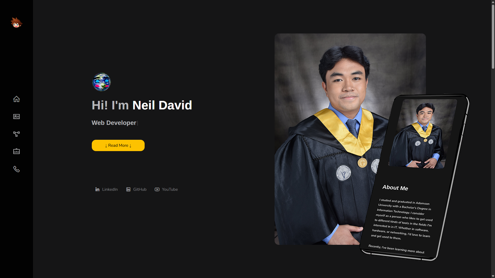

<h2 align="center">
  Panma 
  <a href="https://fiiels-portfolio.netlify.app" target="_blank">fiiels-portfolio.netlify.app</a>
</h2>
<h4 align="center">Portfolio Website</h4>

  

## ⚒️ Built With
  
  
  
  
  

## 💡Features
  - Fully responsive website
  - Modern UI design
  - Single page layout
  - Uses Bootstrap grid system
  - Utilizes [ShuffleJS](https://shuffle.js.org)

## 👤 Contributor
  [Fiiel](https://github.com/Fiiel)

## 📃 License
Code released under the MIT License

Built by @Fiiel for his own portfolio. **Copyright (c) 2026 by Fiiel**. 
